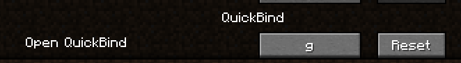
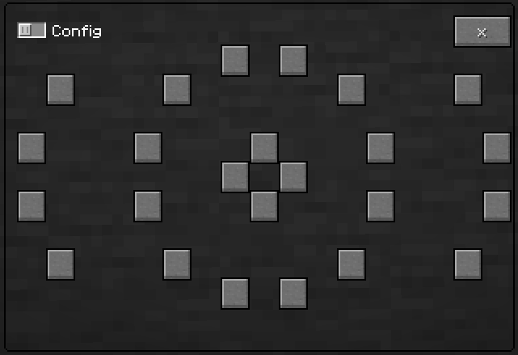
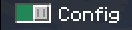
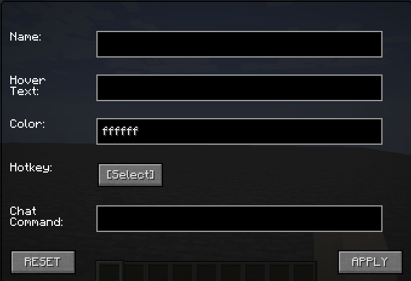

# QuickBind
Menu screen used to create and bind mod hotkeys, chat messages, or commands to buttons.

## How to use:
[IMPORTANT] Requires Malilib from this link: https://masa.dy.fi/mcmods/client_mods/?mcver=1.16.4

###Bind a key to open quickbind in Minecraft options -> controls:

###Press the keybind to open the menu:

####Press the config button to enter config mode, and click on a blank button.

###Options screen:

Have fun! (Remember to turn off config mode)